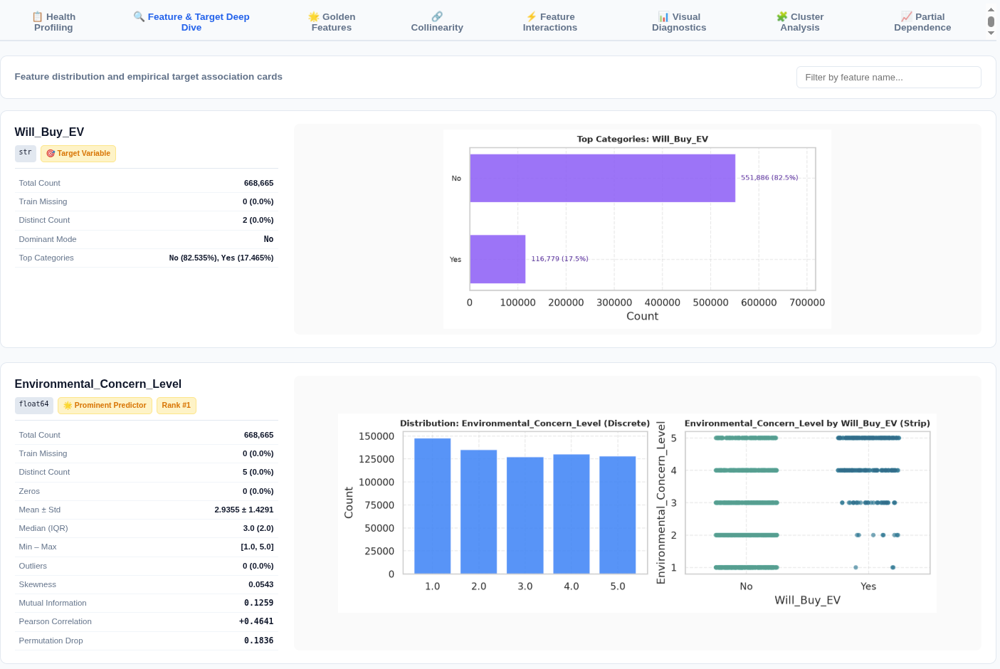
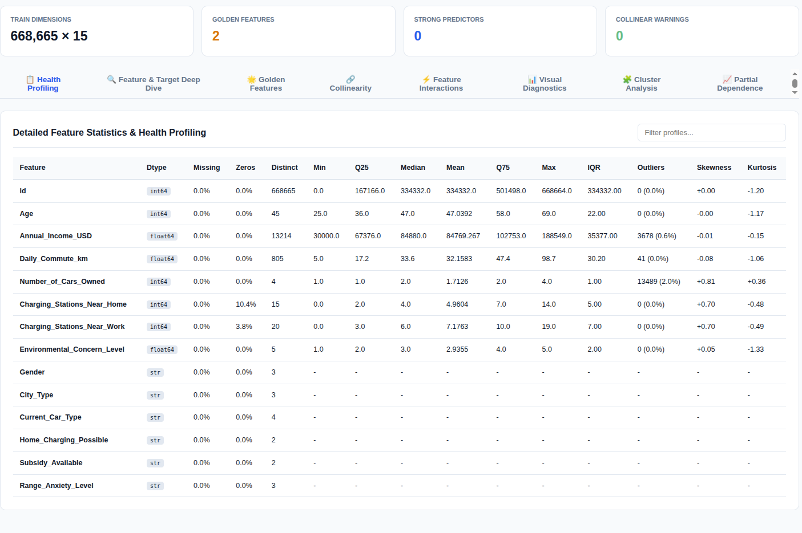
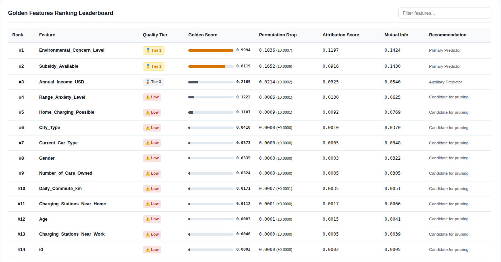
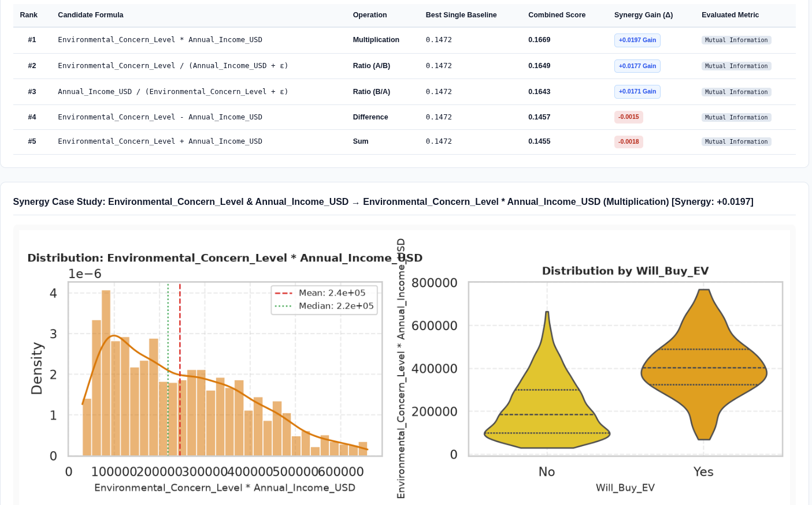
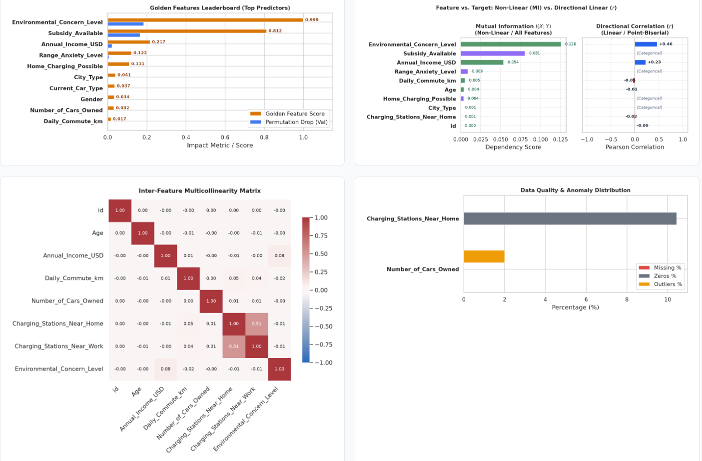
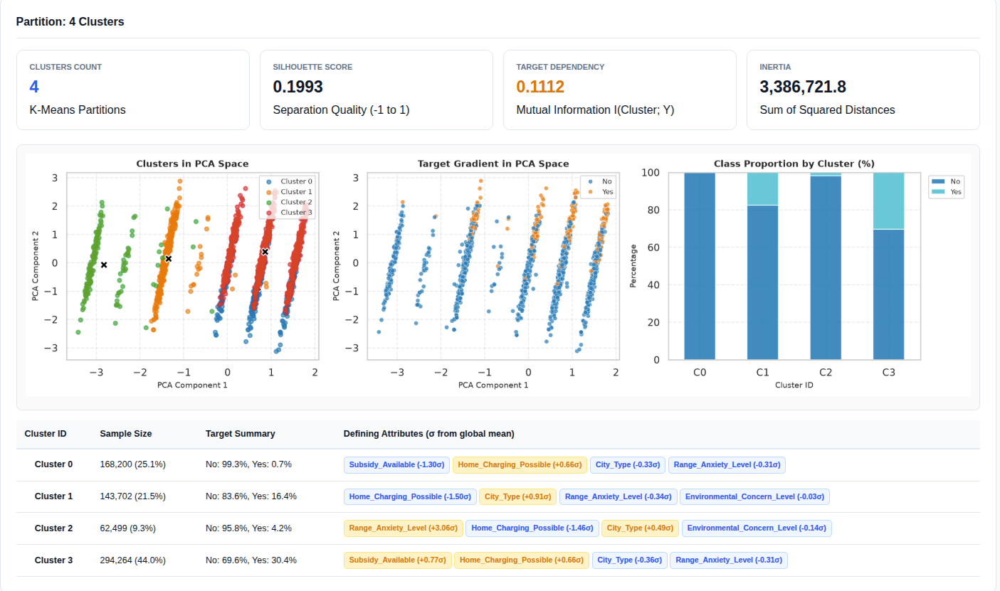

# yaEDA: Yet Another EDA 🚀

[](https://github.com/your-username/yaEDA/actions)
[](https://pypi.org/project/yaeda/)
[](https://pypi.org/project/yaeda/)
[](https://opensource.org/licenses/MIT)

> [!WARNING]
> **Active Development Status**: yaEDA is currently in active pre-1.0 development. APIs, configuration parameters, and export schemas are subject to change between minor releases. Feedback, bug reports, and pull requests are welcome!

**yaEDA** (Yet Another EDA) is an automated tabular feature intelligence, data profiling, and model error diagnostics library built specifically for competitive machine learning and tabular data workflows.

Unlike standard profiling tools that merely produce univariate histograms, yaEDA acts as an automated feature engineering assistant: it isolates predictive signals, discovers non-linear feature interactions, tracks multi-dataset distribution drift (e.g., Train vs. Test), identifies unseen categorical levels, segments cluster spaces, and dissects where and why models make mistakes.

---

## Pre-Computed Interactive Reports

Explore sample reports generated across various real-world execution modes:

| Execution Mode                     | Description                                                                                 |                   Interactive Dashboard                   |                 Machine-Readable Metadata                 |
| :--------------------------------- | :------------------------------------------------------------------------------------------ | :-------------------------------------------------------: | :-------------------------------------------------------: |
| **1. Supervised Single Dataset**   | Full supervised profiling with target column, Golden Features, PDP curves, and interactions |  [View HTML](artifacts/exports/1_supervised_single.html)  |  [View JSON](artifacts/exports/1_supervised_single.json)  |
| **2. Supervised Multi-Dataset**    | Primary (Train with target) vs. Secondary (Test unlabelled), drift tracking & KDE overlays  |  [View HTML](artifacts/exports/2_supervised_multi.html)   |  [View JSON](artifacts/exports/2_supervised_multi.json)   |
| **3. Unsupervised Single Dataset** | Unlabelled dataset exploration, feature health, and PCA cluster partitioning                | [View HTML](artifacts/exports/3_unsupervised_single.html) | [View JSON](artifacts/exports/3_unsupervised_single.json) |
| **4. Unsupervised Multi-Dataset**  | Cohort A vs. Cohort B comparative distribution, missingness shift, and novel levels         | [View HTML](artifacts/exports/4_unsupervised_multi.html)  | [View JSON](artifacts/exports/4_unsupervised_multi.json)  |

---

## Core Features & Visual Walkthrough

### 1. Multi-Dataset Drift & Parity Analysis

- **Missingness Drift Tracking**: Calculates directional delta ($\Delta$) missing percentages between Primary (Train) and Secondary (Test) splits.
- **Unseen Categorical Detection**: Automatically identifies and flags categories present in test sets that never appeared in training data.
- **Distribution Overlays**: Overlaid continuous KDE curves and grouped categorical bar charts with `[UNSEEN]` tags.

### 2. Feature Deep-Dive & Distribution Overlays

Detailed feature cards combining statistical metrics (quantiles, missingness, zero counts, outliers, skewness) with adaptive visual plots. When secondary datasets are present, cards display overlaid Train vs. Test density curves and side-by-side boxplots.





### 3. Golden Feature Discovery & Ranking

Combines multiple perspectives into a single composite rank score:

- **Tree Feature Importance (MDI)**
- **Out-of-Sample Permutation Drop** on validation splits
- **Non-Linear Mutual Information ($I(X; Y)$)**
- **Attribution Sensitivity** (Tree SHAP or PDP variance)

Features are partitioned into actionable tiers: **Tier 1 (Golden)**, **Tier 2 (Strong)**, **Tier 3 (Moderate)**, and **Tier 4 (Noise/Prune)**.



### 4. Pairwise Feature Interactions & Arithmetic Synergy

Evaluates pairwise combinations ($A \times B$, $A / B$, $A + B$, $A - B$) against individual univariate baselines to surface engineered features that provide mathematical synergy gains.



### 5. Multicollinearity & Visual Diagnostics

Directly flags redundant collinear pairs ($\vert{}r\vert{} \ge 0.80$) across Pearson and Spearman correlations, visualizes target associations, and isolates data quality outliers.



### 6. Unsupervised Cluster Profiling in PCA Space

Executes KMeans clustering across multiple candidate dimensions ($k$), evaluates silhouette separation, projects instances into 2D PCA space, profiles centroid deviations ($\sigma$ z-scores from global mean), and measures cluster-to-target mutual information.



### 7. Model Error Forensics & SHAP Attribution

Pass model predictions to partition failure cohorts (False Positives, False Negatives, residual extremes). yaEDA ranks the worst errors, displays prediction confidence, and isolates distinguishing feature attributes alongside global Beeswarm and local Waterfall plots.

---

## Installation

Install using `pip`:

```bash
# Core package (lightweight, zero heavy binary dependencies)
$ pip install yaeda

# With SHAP model interpretability support
$ pip install "yaeda[shap]"

# Full installation (SHAP + WeasyPrint PDF export)
$ pip install "yaeda[all]"
```

Or add via `uv`:

```bash
$ uv add yaeda --extra shap
```

## Quickstart

### 1. Supervised Analysis with Multi-Dataset Comparison

```python
import pandas as pd
from yaeda import TabularEDA

train_df = pd.read_csv("artifacts/data/train.csv")
test_df = pd.read_csv("artifacts/data/test.csv")

eda = TabularEDA(
    # Primary dataset: Tuple of (DataFrame, "Name")
    df=(train_df, "Train"),
    target="Will_Buy_EV",
    # Secondary datasets: Automatically monitored for drift and unseen categories
    secondary_dfs=[(test_df, "Test")],
    # KMeans cluster dimensions to profile
    n_clusters=[2, 4],
)

# Export zero-dependency interactive HTML dashboard
eda.to_html("eda_report.html")

# Export compact, structured JSON metadata (< 100 KB)
eda.to_json("eda_summary.json")
```

### 2. Unsupervised / Unlabelled Dataset Profiling

```python
# target=None activates unsupervised mode
eda = TabularEDA(
    df=test_df,
    target=None,
    n_clusters=[3],
)

eda.to_html("unsupervised_report.html")
```

## Examples (`examples/`)

Runnable, standalone demonstration scripts are available in the examples/ folder:

- `examples/quickstart.py`: Minimal, commented walkthrough demonstrating data loading, initialization, clustering, and reporting.

To run an example script:

```bash
$ uv run examples/quickstart.py
```

## Development & Testing

yaEDA is managed using `uv` and tested with pytest.

```bash
# 1. Clone the repository
$ git clone [https://github.com/your-username/yaEDA.git](https://github.com/rnascunha/yaEDA.git)
$ cd yaEDA

# 2. Create virtual environment and install all dependencies
$ uv sync --extra dev --extra all

# 3. Run linting & formatting checks
$ uv run ruff check .

# 4. Execute the test suite with coverage
$ uv run pytest --cov=yaeda --cov-report=term-missing
```

## License

This project is licensed under the terms of the [MIT License](./LICENSE).